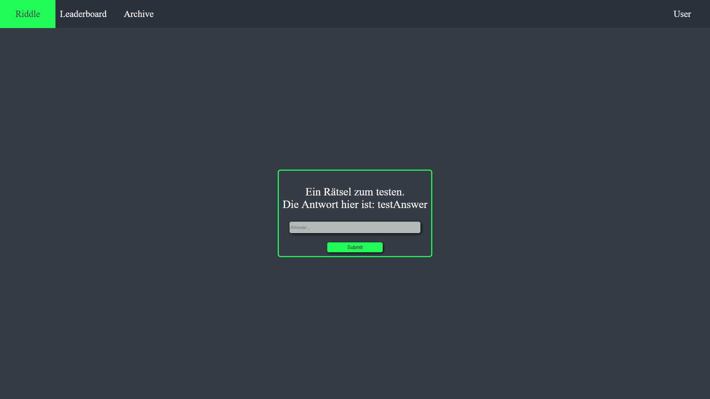

# Projekt: The Library - Riddle Challenge

Dieses Projekt entstand im Rahmen der Prüfungsleistung im Jahre 2019 für das Modul "Programmieren interaktiver Systeme", welches mit 100% bestanden wurde. Es handelt sich hierbei um einen Java-Server mit html/css/javaScript frontend. Die unten aufgeführte Dokumentation war Teil der Abgabe und enthält demnach einige speziell dafür vorgesehene Anmerkungen.

Der Server wird mit 'gradle run' gestartet und ist dann unter localhost:7777 erreichbar.

- [Projekt: The Library - Riddle Challenge](#Projekt-The-Library---Riddle-Challenge)
  - [Kurzbeschreibung inkl. Screenshot](#Kurzbeschreibung-inkl-Screenshot)
  - [Beschreibung des Projektaufbaus](#Beschreibung-des-Projektaufbaus)
    - [Abgabedateien (LOC)](#Abgabedateien-LOC)
    - [Testdateien (TST)](#Testdateien-TST)
    - [Aufbau der Anwendung](#Aufbau-der-Anwendung)
      - [App.java](#Appjava)
      - [Library.java](#Libraryjava)
      - [User.java](#Userjava)
      - [Riddle.java](#Riddlejava)
      - [AccountManager.java](#AccountManagerjava)
      - [login.html](#loginhtml)
      - [index.html](#indexhtml)
      - [leaderboard.html](#leaderboardhtml)
      - [archive.html](#archivehtml)
  - [Dokumentation des implementierten WebAPIs](#Dokumentation-des-implementierten-WebAPIs)
    - [/getcurriddle](#getcurriddle)
    - [/submitanswer](#submitanswer)
    - [/sse](#sse)
    - [/login](#login)
    - [/logout](#logout)
    - [/register](#register)
    - [/getleaderboard](#getleaderboard)
    - [/loadriddlewithnumber](#loadriddlewithnumber)
  - [Dokumentation der Methoden](#Dokumentation-der-Methoden)
    - [Die Klasse Library.java](#Die-Klasse-Libraryjava)
      - [readRiddleFromJson() / writeRiddleToJson()](#readRiddleFromJson--writeRiddleToJson)
      - [updateRiddleOnClients()](#updateRiddleOnClients)
      - [updateRiddleID()](#updateRiddleID)
      - [solveRiddle()](#solveRiddle)
    - [Die Klasse Riddle.java](#Die-Klasse-Riddlejava)
    - [Die Klasse User.java](#Die-Klasse-Userjava)
    - [Die Klasse AccountManager.java](#Die-Klasse-AccountManagerjava)
      - [addUser()](#addUser)
      - [getUser()](#getUser)
      - [loginUser()](#loginUser)
      - [sortList()](#sortList)
      - [getLeaderBoard()](#getLeaderBoard)
      - [loadUserData() / saveUserData()](#loadUserData--saveUserData)
  - [Technischer Anspruch (TA) und Umsetzung der Features](#Technischer-Anspruch-TA-und-Umsetzung-der-Features)
    - [Speicherung/Abruf von Daten um lokalen Dateisystem](#SpeicherungAbruf-von-Daten-um-lokalen-Dateisystem)
    - [Server-Sent-Events](#Server-Sent-Events)
    - [Cookies](#Cookies)
    - [JSON](#JSON)
  - [Verwendete Libraries](#Verwendete-Libraries)
  - [Quellennachweis](#Quellennachweis)

## Kurzbeschreibung inkl. Screenshot

> The Library - Riddle Challenge ist ein semi-synchrones Online-Rätselspiel bei dem es, wie der Name schon vermuten lässt, darum geht Rätsel zu lösen. Für jedes gelöste Rätsel erhält man hierbei 100 Punkte.
> Das besondere daran ist, dass alle Spieler immer das selbe Rätsel vor sich haben. Wird ein Rätsel gelöst, so ändert sich automatisch auch bei jedem anderen Spieler das aktuelle Rätsel. Deshalb ist die Schwierigkeit eines Rätsels - relativ gesehen - hoch angesetzt und erfordert manchmal ein gewisses „um-die-ecke-denken“, um einen spannenderen und länger anhaltenden Wettbewerb zu schaffen.
> Dementsprechend steht für die Lösung eines Rätsel nur eine gewisse Zeitspanne zur Verfügung, in der die Spieler sich in ihrer Fähigkeit Rätsel zu lösen messen, um sich die jeweils 100 Punkte zu sichern, auf dem Leaderboard einen höheren Platz zu ergattern und somit ihre Mitspieler zu übertrumpfen.



**Hinweise**:

Da mein Konzept nicht vorsieht, dass ein Rätsel mehrmals gelöst wird, das Lösen selbst aber trotzdem getestet werden muss, sind folgende Sachen zu beachten:

* Bitte die Tests als erstes Ausführen. Nach dem Ausführen setzt die Testklasse durch eine mit @AfterClass annotierte Methode alles wieder auf den Anfangszustand zurück.
* Die ID des aktuellen Rätsels wird in curRiddleID.txt gespeichert. Bei Abgabe und Start nach den Tests ist diese auf 1 gesetzt. Sollte es notwendig sein die riddleID zurückzusetzen, z.B. um erneut die Funktionalität zu testen, so muss diese ID von Hand in der genannten .txt Datei zurückgesetzt werden, da das Programm selbst keine Möglichkeit zum Zurücksetzten der Räsel vorsieht.

## Beschreibung des Projektaufbaus

### Abgabedateien (LOC)

| Verlinkter Dateiname                                             | Dateiart | LOC |
| ---------------------------------------------------------------- | -------- | --- |
| [App.java](src/main/java/Library/App.java)                       | Java     | 7   |
| [Library.java](src/main/java/Library/Library.java)               | Java     | 133 |
| [AccountManager.java](src/main/java/Library/AccountManager.java) | Java     | 76  |
| [Riddle.java](src/main/java/Library/Riddle.java)                 | Java     | 24  |
| [User.java](src/main/java/Library/User.java)                     | Java     | 37  |
| [index.html](src/main/resources/public/index.html)               | HTML     | 124 |
| [login.html](src/main/resources/public/login.html)               | HTML     | 95  |
| [archive.html](src/main/resources/public/archive.html)           | HTML     | 115 |
| [leaderboard.html](src/main/resources/public/leaderboard.html)   | HTML     | 104 |
| [library.js](src/main/resources/public/library.js)               | JS       | 78  |
| Gesamt LOC:                                                      |          | 793 |

### Testdateien (TST)

| Verlinkter Dateiname                                         | Testart   | Anzahl der Tests |
| ------------------------------------------------------------ | --------- | ---------------- |
| [LibraryTests.java](src/test/java/Library/LibraryTests.java) | JUnit4.12 | 35               |

Die Tests werden wie folgt ausgeführt:

Die Tests werden durch ein simples `gradle test` gestartet.

### Aufbau der Anwendung

Die Anwendung ist relativ simple aufgebaut.
Im Hintergrund arbeitet ein Java-Server mit javalin 2.8, dessen WebAPIs und Methoden im Anschluss erklärt werden.
Das Frontend besteht aus mehreren Html-Seiten.

#### App.java

Diese Klasse ist ausschließlich zum Start der Anwendung vorgesehen.

#### Library.java

In dieser Klasse befinden sich die ganzen Requests, sowie einige Helper-Methoden die beim laden neuer Rätsel nützlich sind.

#### User.java

Ein Nutzer wird durch ein Objekt dieser Klasse repräsentiert.

#### Riddle.java

Riddle.java enthält alle Informationen die ein Rätsel benötigt.

#### AccountManager.java

Hier finden sich alle Methoden, die mit Anmeldung, Registrierung sowie generellen Aktionen mit Nutzern zusammenhängen.

#### login.html

Die login.html Seite stellt die Schnittstelle da, mit derer Hilfe sich User anmelden oder registrieren können. Sofern ein User nicht bereits angemeldet ist, wird er automatisch beim aufrufen einer der anderen Seiten auf diese Login-Seite umgeleitet. Nutzer können sich nur mit einem Namen registrieren, der noch nicht verwendet wurde. Für den Versuch sich anzumelden, existiert zudem ein Feedback, falls die Anmeldedaten falsch sind.

#### index.html

Die index.html ist die eigentliche Hauptseite. Auf ihr wird immer das aktuelle Rätsel oder, wenn zur Zeit kein weiteres Verfügbar ist, eine Art Platzhalter angezeigt. Zudem gibt es eine Leiste am Anfang der Seite, die dem User bei der Navigation hilft und es ihm ermöglicht sich durch ein Dropdown-Menü auszuloggen, dass erscheint, wenn er über seinen Namen hovert.

#### leaderboard.html

leaderboard.html ist die Hauptinformationsquelle wenn es um den kompetitiven Aspekt der Anwendung geht. Auf der Seite werden sowohl die Punkte des Users, als auch eine Bestenliste mit den (standardmäßig) 7 Besten angezeigt. Auch auf dieser Seite existiert die Navigationsleiste samt Logout-Dropdown.

#### archive.html

Die Archive Seite bietet dem Nutzer die Möglichkeit auf vergangene Rätsel zurückzublicken. Gelöste Rätsel können hier erneut abgefragt werden, wobei sowohl die Antwort, der User als auch das Datum an dem das Rätsel gelöst worden ist, angezeigt werden. Die Navigationsleiste ist auch hier vorhanden.

## Dokumentation des implementierten WebAPIs

### /getcurriddle

Wird benutzt um den  Text des momentan aktiven Rätsels bzw. den Platzhalter, falls im Moment kein Rätsel mehr vorhanden ist, vom Server zu erfragen.

### /submitanswer

Hier wird ein Antwortvorschlag an den Server gegeben. Der Server vergleicht nun den Vorschlag mit der Lösung des Rätsels. Stimmt die Lösung, so wird aus dem Cookie der Nutzername ausgelesen. Zum einen um dem Spieler seine Punkte gutzuschreiben zum anderen um im aktiven Rätsel den Nutzer als Rätsellöser zu verewigen. Im Anschluss wird das alte Rätsel mit dem Nutzernamen und Zeitstempel gespeichert und das darauffolgende Rätsel geladen. Dieses wird dann an alle verbundene Client via Serer-Sent-Events geschickt.

### /sse

Diese Request dient dazu um einen neu verbundenen Client in der dazugehörigen Queue zu speichern. Dies wird benötigt um bei der Lösung eines Rätsels das darauffolgende an alle Clients zu übermitteln.

### /login

Der Request wird der Username und das Passwort übergeben. Der Server vergleicht daraufhin das übergebene Password mit dem User-Objekt, dass anhand des Usernames aus einer Liste des Account-Managers identifiziert wird. Stimmt das Passwort überein, wird ein Cookie gesetzt, der den Usernamen des Nutzers beinhaltet und auch für die Weiterleitung im Browser benutzt wird.
Ist das Passwort jedoch falsch, wird ein `"wrongCredentials"` an den Client gesendet, was für das Feedback an den User genutzt wird.

Die login-Request ist relativ simple aber damit auch sehr offen für Angriffe. Das Passwort wird in ungehashter Form übermittelt und gespeichert und daher sollte diese Methode der Accountverwaltung *niemals* ausßerhalb eines Prototyps genutz werden. Auch Cookies lassen sich leicht fälschen, was die Sicherheit dieser Herangehensweise weiter senkt.

### /logout

Die logout-Request löscht den Cookie mit dem Usernamen, woraufhin der Client automatisch wieder auf die login.html Seite weitergeleitet wird.

### /register

Übergeben werden dieser Request der gewünschte Username sowie ein Passwort und eine Email.
Der Server überprüft nun, ob bereits ein Nutzer mit dem selben Namen existiert. Ist dies nicht der Fall wird der Nutzer registriert und direkt durch setzten eines Cookies mit seinem Nutzername angemeldet. Existiert bereits ein Nutzer mit dem gewünschten Namen so wird ein `"username already in use"` zurückgegeben.

### /getleaderboard

Diese Request gibt das Leaderboard zurück, sowie die Punkte des Nutzers, der die Seite aufruft.

### /loadriddlewithnumber

Hier wird ein Rätsel anhand seiner ID geladen und zurückgegeben, was vor Allem für das Archiv genutzt wird. Ist die übergebene `riddleid` leer, so wird das zuletzt gelöste Rätsel zurückgegeben. Gehört die angefragte Rätsel-ID zu einem Rätsel, dass noch nicht gelöst wurde, so gibt die Request `This Riddle has not been solved yet!`, sowie die aktuelle Rätsel-ID zurück. Für den Fall das die angefragte Rätsel-ID legitim ist, wird das Rätsel aus der dazugehörigen JSON-Datei gelesen und zurückgegeben.

## Dokumentation der Methoden

Aufgrund der LOC-Beschränkung wurde bewusst auf ein Interface verzichtet. Deshalb wird als Ersatz nun auf die einzelnen Klassen eingegangen:

### Die Klasse Library.java

Die Datei Library.java beinhaltet neben den Requests noch folgende Methoden:

#### readRiddleFromJson() / writeRiddleToJson()

Diese beiden Methoden sind dafür zuständig, Rätsel aus JSON zu eine Object der Klasse Riddle zu parsen, bzw. ein Object der Klasse Riddle in JSON zu übersetzen.

#### updateRiddleOnClients()

Diese Methode sorgt dafür, dass der Text des aktuellen Rätsels an alle Clients geschickt wird.

#### updateRiddleID()

Hier wird die `curRiddleID` um 1 erhöht und im Anschluss in `curRiddleID.txt` gespeichert.

#### solveRiddle()

solveRiddle() wird aufgerufen wenn ein Rätsel gelöst wurde. In dieser Methode wird die JSON-Datei des gelösten Rätsels geupdatet und mit der aktuellen Zeit und dem Nutzernamen des Rätsellösers versehen.
Außerdem erhält der entsprechende Nutzer 100 Punkte. Zum Abschluss wird die UserListe gespeichert, und das nächste Rätsel geladen.

### Die Klasse Riddle.java

Die Klasse Riddle.java enthält getter/setter-Methoden für die Attribute `solvedBy` sowie `solvedOn`. Desweiteren existiert eine getter-Methode für den `riddleText` und eine Methode `checkAnswer()`, die überprüft, ob eine Antowrt richtig ist.

### Die Klasse User.java

Die Klasse User hat einen Konstruktor, mit dem sich der Nutzername, das Passwort und die Email setzten lässt. Desweiteren initialisiert der Konstruktor die Variable `points` auf 0;

User.java hat zudem getter-Methoden für den Username, das Passwort, die Email und die Punkte.
`addPoints()` fügt zudem Punkte dem Punktekonto des Users hinzu.

Es werden außerdem die beiden Interface Serializable und Comparable<> implementiert.

Serializable ist hier nötig, da die User Objecte der Userliste mit Serilization gespeichert werden, um die Accounts auch nach einem Server-Restart zu erhalten.

Comparable wird implementiert um die Userliste anhand der Punkte eines Users zu ordnen, um die Ausgabe des Leaderboards zu erleichtern.

### Die Klasse AccountManager.java

Der AccountManager hat eine userList in der alle Accounts gespeichert werden, sowie eine Variable `leaderboardEntries`, die die Anzahl der Plätze des Leaderboards definiert.
Im Konstruktor wird, falls vorhanden, die gespeicherte Userliste geladen.

Desweiteren existieren die folgenden Methoden:

#### addUser()

Diese Methode fügt der userList einen neuen User hinzu und speichert die Userliste danach direkt mit dem neuen Nutzer ab.

#### getUser()

getUser() nimmt einen `String username` entgegen, und durchsucht die userList nach einem User-Objekt, dessen Nutzername dem übergebenen String entspricht. Wenn ein Objekt gefunden wird, wird dieses zurückgegeben.

#### loginUser()

Hier wird ein User mit Hilfe der getUser() Methode identifiziert und im Anschluss wird das Passwort des Users mit dem übergebenen Passwort abgeglichen. Anhand des Ergebnises wird entweder ein `true` oder ein `false` zurückgegeben.

#### sortList()

Sortiert die Liste anhand der in User.java implementierten Comparable<> Schnittstelle.

#### getLeaderBoard()

Diese Methode erstellt zuerst eine subList aus der `userList`. Da die Liste im Vorfeld sortiert wurde, steht an erster Stelle stets der User mit den meisten Punkten.

Nun wird jeder Nutzer der subList, dessen Punkte > 0 sind, zum leaderBoard hinzugefügt. Der Rest wird mit Platzhaltern aufgefüllt und im Anschluss zurückgegeben.

#### loadUserData() / saveUserData()

Diese Beiden Methoden sind jeweils fürs laden bzw. fürs speichern der `userList` unter Verwendung von Deserilization bzw. Serilization zuständig.

## Technischer Anspruch (TA) und Umsetzung der Features

Ich habe folgende Features verwendet. Die verlinkte Datei zeigt beispielhaft den Einsatz dieses Features in den angegebenen Zeilen im Quellcode.

1. Speicherung/Abruf von Daten im lokalen Dateisystem [Library.java](src/main/java/Library/Library.java) (136 - 147)
2. Server-Sent-Events [Library.java](src/main/java/Library/Library.java) (127-134)
3. Cookies [Library.java](src/main/java/Library/Library.java) (65)
4. JSON [Library.java](src/main/java/Library/Library.java) (108-125)

### Speicherung/Abruf von Daten um lokalen Dateisystem

Hier geht es um die Speicherung der Variable `curRiddleID` mit einem PrintWriter bzw. das lesen der selbigen mit einem BufferedReader. Diese muss auch nach einem Neustart des Servers erhalten bleiben, da es ein wichtiger Aspekt ist, das sich Rätsel nicht reseten.

### Server-Sent-Events

Server-Sent-Events werden benutzt, sobald ein Rätsel gelöst wurde. Sie sind dafür verantwortlich, dass neue Rätsel an alle Clients geschickt werden, sodass jeder Client das neue Rätsel anzeigt.
Das funktioniert wie folgt:

1. Wenn ein neuer Client connected, wird dieser vom Server in einer ConcurrentLinkedQueue (übernommen von der Javalin-Seite) abgespeichert. Wenn ein Client disconnected wird er entsprechend wieder entfernt.
2. Sobald ein Rätsel gelöst wurde, wird mit Hilfe der Javalin-Library an alle gespeicherte Clients ein Event geschickt.
3. Das Clientseitige Javascript interpretiert das Event und zeigt den neuen Rätseltext an.

### Cookies

Es wird ein Cookie benutzt um den Client sozusagen als "angemeldet" zu kennzeichnen. Gleichzeitig enthält der Cookie den Nutzernamen des Users, der sowohl zum Anzeigen, als auch zur Übermittlung des selbigen genutzt wird.

In Javalin lässt sich ein Cookie einfach durch das Context Object setzten:
`ctx.cookie(NAME, VALUE);`

### JSON

JSON wird hier benutzt um die einzelnen Rätsel leichter abzuspeichern. Zum Einsatz kommt hierbei die Library Gson, welche ein Annotationfreies parsen von JSON zu Java Object und vice versa ermöglicht.
Dies sorgt dafür, dass ein Rätsel bei Bedarf einfach mit dem folgenden Code geladen werden kann:

```java
Gson gson = new Gson();
JsonReader reader = new JsonReader(new InputStreamReader(new FileInputStream(FILE), "UTF-8"));
Riddle riddle = gson.fromJson(reader,Riddle.class);
```

## Verwendete Libraries

* Javalin
* Gson

## Quellennachweis

* JSON-To-Java Parser: https://github.com/google/gson
* EventSource und Server-Sent-Events: https://www.html5rocks.com/en/tutorials/eventsource/basics/
* Javalin-Documentation: https://javalin.io/archive/docs/v2.8.0.html
* Javalin Server-Sent-Events: https://javalin.io/news/2019/01/17/javalin-2.6.0-released.html
* Login-System: PIS (Fr1/Kr) Töröö-Projekt
* Logout-Dropdown: https://www.drweb.de/responsives-css-dropdown-menue-ohne-javascript/
* Navigationsleiste: https://www.w3schools.com/css/css_navbar.asp
* gradle test fancy output: https://stackoverflow.com/questions/3963708/gradle-how-to-display-test-results-in-the-console-in-real-time
